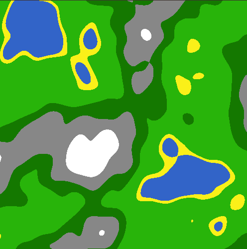
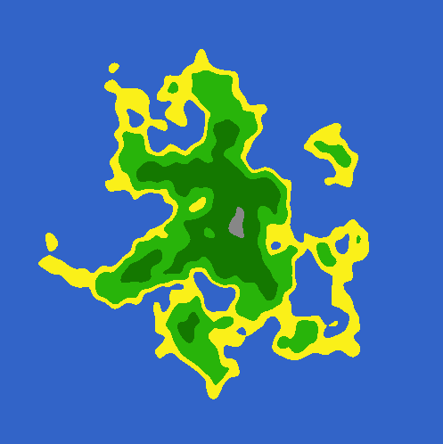

# Landscape Generation
Generate terrain using the OpenSimplex noise algorithm, see [here](https://www.redblobgames.com/maps/terrain-from-noise) for a great tutorial. We additionally implemented a mask which can be used to generate islands. Adjusting the biome values and zoom setting can greatly improve results.
